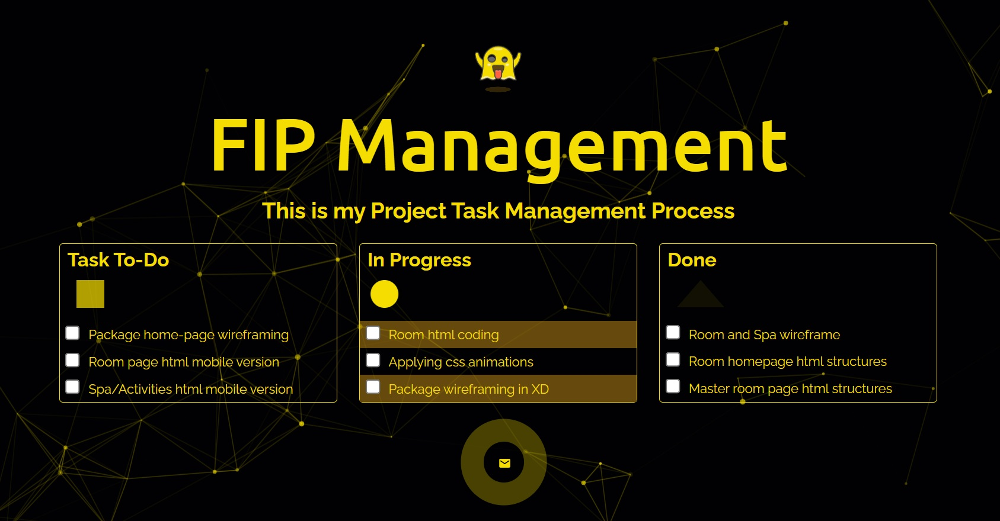

# Gohetia_Sheldon_HW3

This repo is for Homework 3 – CSS CASCADE, SELECTION &amp; PSEUDO SELECTORS

## To-Do List Concept for the Webpage Design

In this design concept, I choose to use only specific Color Palette for the rest of the page. I also incorporated some previous lessons like Cascading, Animations, Lightbox and Pseudo selectors.

### Additional input

I added some scripts to achieve the "Cell Particles" background animation. I came up with this idea after playing Cyberpunk. I did some research and found some useful reference to achieve 75% of looks and feel, not perfect but I like this.

## Installation

No installation is required.

## Usage

Open the index file in your browser of choice.
Try to click and hover your cursor in the particle background of the page to see some cool and random flow of animation.

## History

No history is required

## Credits

Sheldon Gohetia

## License

MIT - see license file for more information.
